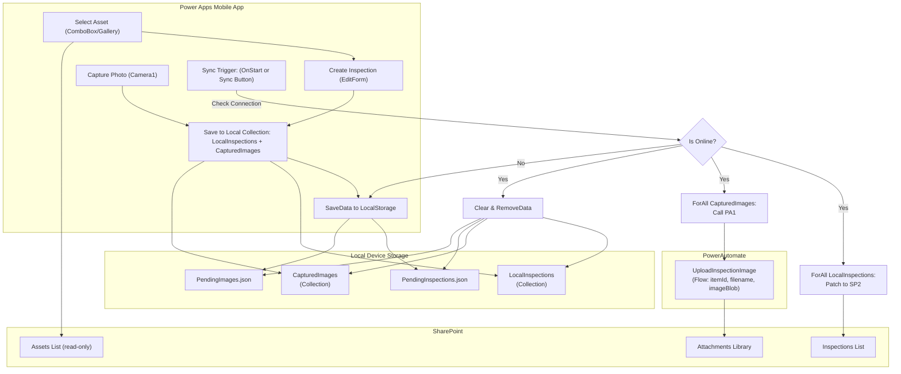

```mermaid
flowchart TD
    subgraph Mobile_App [Power Apps Mobile App]
        A1["Select Asset (ComboBox/Gallery)"]
        A2["Create Inspection (EditForm)"]
        A3["Capture Photo (Camera1)"]
        A4["Save to Local Collection: LocalInspections + CapturedImages"]
        A5["SaveData to LocalStorage"]
        A6["Sync Trigger: (OnStart or Sync Button)"]
    end

    subgraph Local_Device [Local Device Storage]
        L1["LocalInspections\n(Collection)"]
        L2["CapturedImages\n(Collection)"]
        L3["PendingInspections.json"]
        L4["PendingImages.json"]
    end

    subgraph SharePoint
        SP1["Assets List (read-only)"]
        SP2["Inspections List"]
        SP3["Attachments Library"]
    end

    subgraph PowerAutomate
        PA1["UploadInspectionImage\n(Flow: itemId, filename, imageBlob)"]
    end

    %% App Interactions
    A1 --> A2
    A2 --> A4
    A3 --> A4
    A4 --> A5
    A5 --> L3
    A5 --> L4

    %% Local Collections
    A4 --> L1
    A4 --> L2

    %% Sync Flow
    A6 -->|Check Connection| Z1{Is Online?}
    Z1 -- Yes --> Z2["ForAll LocalInspections:\nPatch to SP2"]
    Z1 -- Yes --> Z3["ForAll CapturedImages:\nCall PA1"]
    Z1 -- Yes --> Z4["Clear & RemoveData"]
    Z1 -- No --> A5

    %% SharePoint Interactions
    Z2 --> SP2
    Z3 --> PA1
    PA1 --> SP3

    %% Read-Only Asset Source
    A1 --> SP1

    %% Cleanup
    Z4 --> L1
    Z4 --> L2
    Z4 --> L3
    Z4 --> L4
```